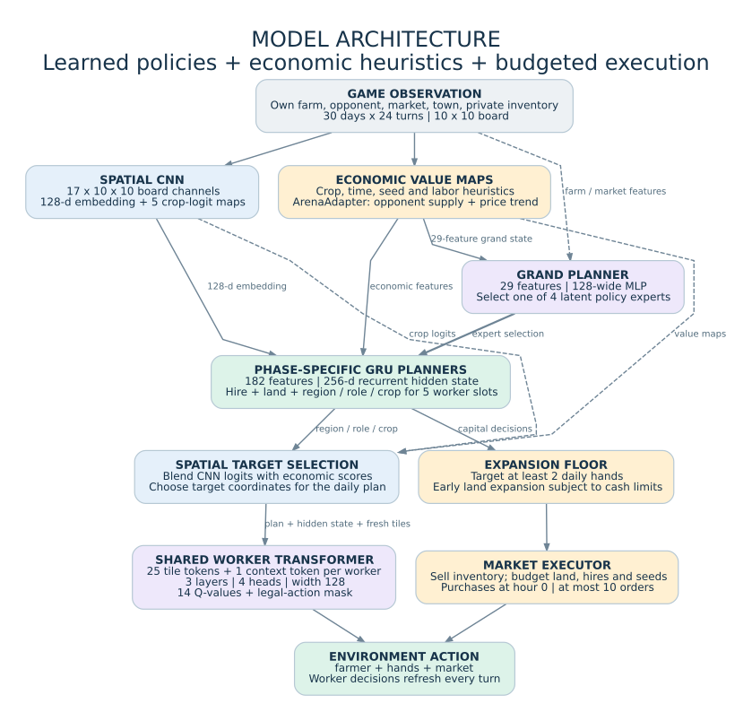
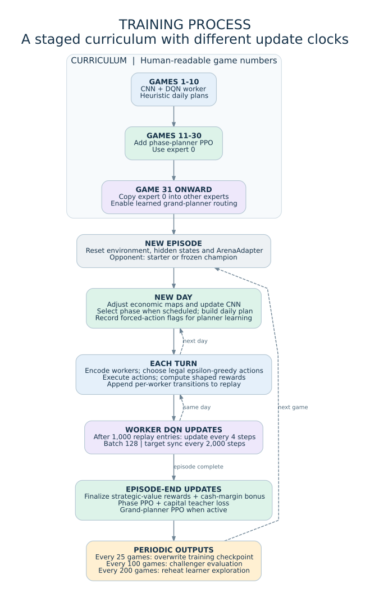
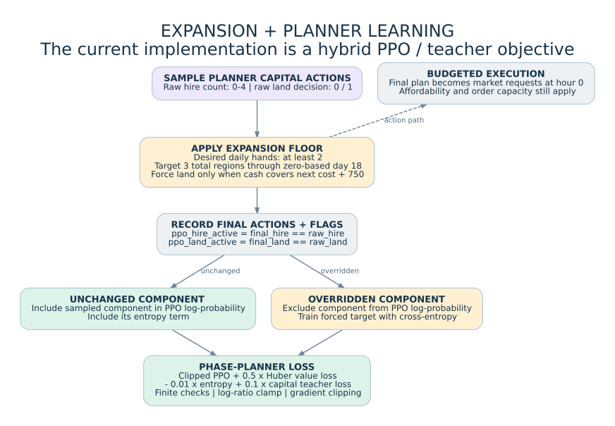
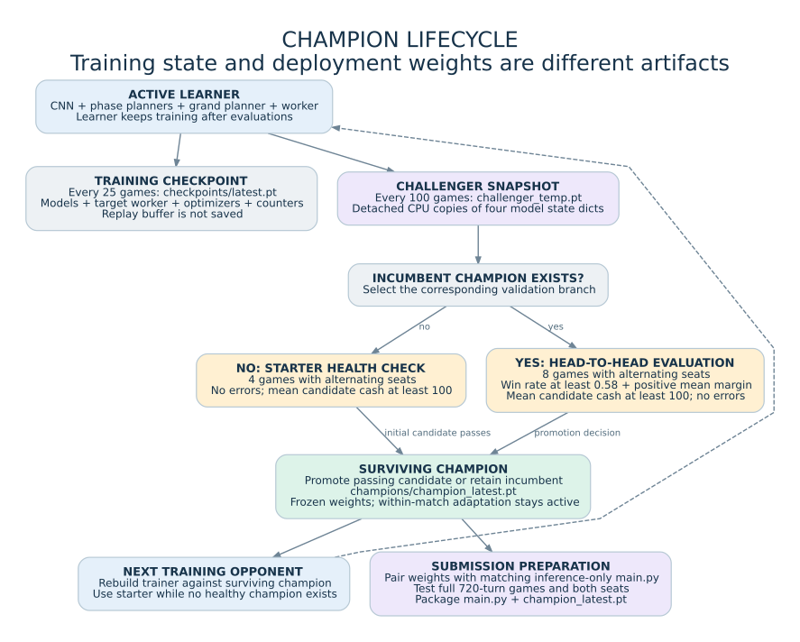

<p align="center">
  
</p>

# Kaggriculture RL Agent

**Plan the farm. Coordinate the workers. Learn through self-play.**

A hierarchical reinforcement-learning agent for the `kaggriculture` environment. The system combines a spatial convolutional network, a strategic phase selector, four recurrent planning experts, and a shared worker transformer. Economic heuristics, legal-action masks, and a budget-aware expansion policy connect the neural decisions to executable farming actions.

**30 days / 24 turns per day / 720-turn horizon** &nbsp; | &nbsp; **PyTorch** &nbsp; | &nbsp; **Colab training** &nbsp; | &nbsp; **PPO + DQN + teacher supervision**

> **Version documented:** the paired `Cell_1_30day_expansion.py` and `Cell_2_30day_expansion.py` files, also embedded in `Kaggriculture_30day_expansion.ipynb`. This is the `30day_expansion_v2` training workflow. Older notebook exports and submission scripts should not be assumed to contain the same behavior.

[Quick start](#quick-start) · [Architecture](#model-architecture) · [Training](#training-process) · [Expansion](#land-and-worker-expansion) · [Checkpoints](#checkpoints-and-self-play) · [Submission](#evaluation-and-submission) · [Troubleshooting](#troubleshooting)

## Overview

Instead of asking one network to learn every decision at the same timescale, the agent separates strategy, daily planning, and turn-by-turn execution.

The **grand planner** selects a policy expert. The selected **GRU planner** chooses hiring, land purchases, and a region, role, and crop for each worker slot. Spatial targeting combines economic estimates with CNN predictions. The **worker transformer** then chooses individual actions, while a separate market executor manages sales, land, hiring, and seeds.

Training uses a staged curriculum and a champion/challenger loop. The active learner improves against a baseline or a frozen champion; a challenger replaces that champion only after passing the configured evaluation gates.

This implementation is crop-focused. Its worker action space covers movement, watering, harvesting, clearing weeds, planting five crop types, and depositing inventory. It does **not** implement the environment's full livestock, fertilizer, and construction action space.

## Quick start

### 1. Open the current notebook

Open [`Kaggriculture_30day_expansion.ipynb`](Kaggriculture_30day_expansion.ipynb) in Google Colab. A GPU can be used; Cell 1 selects CUDA when available and otherwise uses the CPU.

Install the core dependencies in a setup cell:

```python
%pip install numpy torch kaggle-environments
```

The environment package must include `kaggriculture`. Cell 2 also imports `google.colab.drive`, so the supplied training workflow expects Colab and a mounted Google Drive. A local training run requires adapting that Drive setup; it is not a standalone command-line trainer as written.

### 2. Review the run settings before training

In Cell 2, the supplied default is:

```python
NUM_GAMES = 100000
RESUME_TRAINING = True
```

Set `NUM_GAMES` to the intended run length before executing the cell. For a first smoke run, use a small value such as `2`; this checks execution, not learning quality. Default checkpoint and champion creation intervals are longer than that short run.

The current output directory is:

```text
/content/drive/MyDrive/Kaggriculture_RL_30day_expansion_v2
```

Use a new directory for a genuinely fresh experiment. Disabling `RESUME_TRAINING` alone does not prevent Cell 2 from loading an existing champion from its separate champion path.

### 3. Run Cell 1, then Cell 2

**Cell 1** defines models, encoders, economic estimates, rewards, action selection, expansion behavior, optimization helpers, snapshots, and the frozen agent.

**Cell 2** mounts Drive, creates the models and optimizers, restores available state, validates a loaded champion, and starts the training loop.

When replacing cells in an existing notebook, paste each entire replacement file into its corresponding cell and rerun Cell 1 before Cell 2. These two Python files share a notebook namespace; Cell 2 is not independent of Cell 1.

The startup checks enforce:

```python
DAYS_PER_GAME = 30
TURNS_PER_DAY = 24
TURNS_PER_GAME = DAYS_PER_GAME * TURNS_PER_DAY
assert TURNS_PER_GAME == 720
```

The earlier setup/demo cell may create a 200-step environment. That demonstration is separate from the actual training and evaluation environments, which use `TURNS_PER_GAME`.

**Sources:** [Cell 1 constants](Cell_1_30day_expansion.py#L33-L75), [Cell 2 setup](Cell_2_30day_expansion.py#L1-L190), and the [upstream environment installation guide][env-guide].

## Repository files

The files below form the documented training version and its documentation assets. Generated weights live in the run directory, not in this documentation bundle.

```text
.
|-- Kaggriculture_30day_expansion.ipynb   # Complete training notebook
|-- Cell_1_30day_expansion.py            # Complete model/helper cell
|-- Cell_2_30day_expansion.py            # Complete setup/training cell
|-- README.md
`-- docs/
    |-- SOURCE_MAP.md                  # Source provenance and code locations
    |-- assets/                        # Banner + SVG/PNG technical diagrams
    `-- diagrams/                      # Editable Graphviz sources
```

Legacy files such as `kaggriculture.py`, `main.py`, and `main_fixed.py` may still be useful references, but they are not substitutes for the current training cells. In particular, the earlier submission script uses older market-execution logic and does not contain this version's expansion floor.

## Model architecture



*Blue: observations and spatial processing. Purple: neural decision modules. Green: plans and actions. Amber: economic and execution rules. [Editable diagram](docs/diagrams/model-architecture.dot).* 

### Neural components

| Component | Input and structure | Output / role |
|---|---|---|
| `SpatialFarmCNN` | A `17 x 10 x 10` board tensor; three convolutional layers with 32, 64, and 64 channels | A 128-dimensional embedding and five `10 x 10` crop-logit maps |
| `GrandPlanner` | 29 features; two 128-wide hidden layers | Four phase logits plus a value estimate |
| `PlannerExperts` | Four `FarmPlanner` experts; each receives 182 features, uses a 256-wide encoder and a 256-dimensional `GRUCell` | Desired hand count, land decision, per-slot regions/roles/crops, and a value estimate |
| `WorkerTransformer` | 25 region-tile tokens with 18 features each, plus a context token derived from 289 features | Fourteen action Q-values per active worker |

The worker transformer has **three encoder layers, four attention heads, model width 128, and feed-forward width 512**. The same worker network is batched over the farmer and currently active hands; this is not a separate transformer for each worker.

The 289 worker-context features combine the planner hidden state, region/role/crop one-hot encodings, position and time features, target value, inventory, and market prices. The model supports **four hired hands plus the farmer**, for five worker slots in total. That is an implementation limit, not a claim about the environment's maximum possible hiring capacity.

The four phase IDs are **learned latent experts**. They are not hard-coded labels such as "planting phase" or "harvest phase."

**Implementation:** [spatial encoder and CNN](Cell_1_30day_expansion.py#L1419-L1915), [planners](Cell_1_30day_expansion.py#L2019-L2568), [worker encoding and transformer](Cell_1_30day_expansion.py#L3470-L4009).

### Economic teacher and spatial targets

`build_long_term_value_maps()` scores candidate crop/tile combinations using estimated revenue, seed cost, travel, watering, harvest, and deposit effort. `ArenaAdapter` adjusts those maps using moving averages of opponent crop supply and market-price trends.

The CNN is trained against soft distributions derived from these economic maps. Spatial targeting blends standardized economic scores with CNN logits; the training blend ramps toward `0.85`, while frozen-agent targeting uses `0.85` directly.

These are **heuristic value estimates**, not an exact simulator or guaranteed return forecast. The CNN's auxiliary loss supervises its crop-logit branch. Planner inputs are detached NumPy embeddings, so PPO does not backpropagate end-to-end through the CNN.

### Worker and market actions

The 14 worker choices are:

```text
PASS
NORTH / SOUTH / EAST / WEST
WATER / HARVEST / DIG
PLANT WHEAT / CARROT / TOMATO / STRAWBERRY / MELON
PLACE
```

Legal-action masks remove choices that the implementation considers unavailable in the current observation. `PLACE` is converted to an item-and-amount deposit action, rather than emitted as a bare action name.

The market executor sells available crop inventory first. At hour `0`, it then considers land, hiring, and seeds, respecting its cash budgets and ten-order cap. Worker decisions refresh every turn; daily plans and targets generally remain fixed until the next day.

## Training process



*[Editable diagram](docs/diagrams/training-process.dot). Game numbers below are human-readable; the training loop uses zero-based indices.*

| Stage | Games | Behavior |
|---|---:|---|
| Spatial + worker warm-up | 1-10 | Train the spatial CNN and worker DQN under heuristic daily plans, including the expansion floor |
| Planner training | 11-30 | Enable phase-planner PPO while using expert 0 |
| Full hierarchy | 31 onward | Copy expert 0 into the other experts at the transition and enable grand-planner learning |

### Four update clocks

**Each turn:** update the opponent/price adapter, encode active workers, select epsilon-greedy legal actions, step the environment, and add worker transitions to replay.

**Each new day:** finalize the previous daily planner record, construct economic maps, update the spatial CNN, and create a new daily plan. During full-hierarchy training, phase selection is reconsidered at ten-day checkpoints or when the unlocked-shop list changes.

**During rollout:** after replay reaches 1,000 entries, train the DQN every four environment steps with batches of 128. Synchronize the target worker every 2,000 steps. Worker transitions are treated as terminal when the daily option ends or the episode finishes.

**At episode end:** finalize shaped rewards and update phase planners, then update the grand planner when it is active and has enough records. Periodic checkpoints and challenger evaluations follow.

The learner worker's exploration probability decays from `0.60` toward `0.05`. After every 200 completed games, it reheats to `0.25` and decays again. This reheating does not reset model weights and does not change the champion's worker epsilon.

### Learning objectives

| Subsystem | Objective |
|---|---|
| Spatial CNN | Auxiliary soft-target loss from economic planting maps |
| Worker | DQN with a target network, legal next-action masks, and smooth L1 loss |
| Phase planners | Clipped PPO, Huber value loss, entropy regularization, and a capital-action teacher loss |
| Grand planner | A separate clipped-PPO update with its own value and entropy terms |

The phase-planner objective in the current implementation is:

```text
L_phase = L_PPO + 0.5 * L_Huber_value
                  - 0.01 * entropy
                  + 0.1 * L_capital_teacher
```

For PPO-active action components, the phase-planner ratio is computed as:

```python
log_ratio = clamp(new_logp - old_logp, -20.0, 20.0)
ratio = exp(log_ratio)
clipped_ratio = clamp(ratio, 0.8, 1.2)
```

These expressions describe the implemented update, including its teacher-guided modifications; they are not a claim that the policy is purely on-policy PPO.

### Rewards

Daily planner rewards use the change in `strategic_value(obs)`, divided by `100`. That heuristic includes cash, seed purchase value, stored and carried crop inventory, purchased-land value, and estimated remaining crop value.

At the end of a game, the learner also receives a cash-margin signal:

```python
game_reward = 10.0 * np.tanh((my_score - opponent_score) / 5000.0)
```

Worker rewards encourage reaching assigned targets, successful planting, watering, harvesting, weed clearing, and depositing inventory. They also include an economic-delta term and small time/PASS penalties.

**Training reward is not the same quantity as final bank balance.** The former is shaped to aid learning; the latter is what this code uses to compare match scores.

**Implementation:** [reward helpers](Cell_1_30day_expansion.py#L1153-L1408), [worker reward](Cell_1_30day_expansion.py#L4881-L5282), [optimization helpers](Cell_1_30day_expansion.py#L5422-L5916), and [training loop](Cell_2_30day_expansion.py#L865-L2948).

## Land and worker expansion

The agent uses a small, configurable expansion floor so training encounters farms with additional workers and acreage instead of relying solely on rare capital actions emerging from exploration.

| Setting | Default | Meaning |
|---|---:|---|
| `FORCED_MIN_DAILY_HANDS` | `2` | Minimum desired number of hired hands, excluding the farmer |
| `FORCED_MIN_REGIONS` | `3` | Target number of total unlocked regions, including NW |
| `FORCED_LAND_LAST_DAY` | `18` | Last zero-based day on which the land floor may force a purchase |
| `FORCED_LAND_CASH_RESERVE` | `750.0` | Cash buffer required by the forced-land decision |
| `MIN_CASH_RESERVE` | `500.0` | Base reserve used by the market executor |
| `MAX_SEED_SPEND_FRACTION` | `0.25` | Seed-spending cap as a fraction of spendable cash |

The land-cost helper uses the progression `1000 / 2000 / 4000`. The hiring helper uses sequential costs `1, 1, 2, 3, ...` with a default multiplier of `1.0`, and the executor places the additional `HIRE` orders needed to reach the requested daily hand count.

The land floor applies on **days 0 through 18 inclusive**, not for exactly 18 elapsed days. After that cutoff, a learned land purchase can still occur: the cutoff stops forced expansion, not all expansion. The neural planner can also request a third or fourth hand and the fourth region.

> **A desired minimum is not an unconditional guarantee.** The market executor still checks cash, current hands, remaining regions, and order capacity. Its budget starts from observed cash and does not pre-credit same-turn sale proceeds. More land also needs useful worker assignments and sufficient time to generate revenue.

### How forced actions enter learning



*[Editable diagram](docs/diagrams/expansion-learning.dot).* 

`sample_plan_train()` stores the final capital actions and two flags: `ppo_hire_active` and `ppo_land_active`. An unchanged component remains in the PPO log-probability and entropy calculations. An overridden component is excluded from those terms and instead receives supervised cross-entropy toward the final action.

The same expansion helper is used by warm-up plans, stochastic plans, deterministic plans, and market execution. This creates exposure to expanded-farm states and a teacher signal; it does not establish that the learned network will choose the same behavior after the floor is removed.

**Implementation:** [planner sampling](Cell_1_30day_expansion.py#L3274-L3449), [expansion and market execution](Cell_1_30day_expansion.py#L4331-L4827), [phase PPO and teacher loss](Cell_1_30day_expansion.py#L5577-L5916).

## Checkpoints and self-play



*[Editable diagram](docs/diagrams/champion-lifecycle.dot).* 

The run directory contains:

```text
Kaggriculture_RL_30day_expansion_v2/
|-- checkpoints/
|   `-- latest.pt
|-- champions/
|   |-- champion_latest.pt
|   `-- challenger_temp.pt       # Exists temporarily during evaluation
`-- arena/                      # Directory is created by setup
```

`latest.pt` is overwritten every **25 games**. It contains the four main models, the target worker, optimizer states, counters, score history, and champion metadata. The replay buffer is deliberately **not** saved; resuming does not reproduce the exact uninterrupted training state.

Every **100 games**, the learner produces a detached CPU snapshot containing:

```text
spatial_net
planners
grand_planner
worker
game
global_step
```

With no incumbent, a candidate must pass four starter health-check games. With an incumbent, it is evaluated over eight head-to-head games with alternating seats. Promotion requires all of:

```text
win_rate >= 0.58
mean_margin > 0
mean_challenger_score >= 100
error_matches == 0
```

At eight games, the win-rate threshold requires at least five wins. The surviving champion becomes the next training opponent. Temporary challenger files are deleted; only the current champion is retained by this workflow.

**Frozen does not mean deterministic.** The champion's neural weights are fixed and its modules are put in evaluation mode, but phase/planner decisions remain stochastic by default, worker epsilon is `0.05`, and `ArenaAdapter` continues adapting within a match.

Snapshot helpers use `torch.load(..., weights_only=False)`. Load only trusted checkpoints; see the [PyTorch loading documentation][torch-load].

## Configuration reference

| Control | Supplied default |
|---|---:|
| Game horizon | `30 x 24 = 720` |
| `NUM_GAMES` | `100000` |
| Replay capacity / batch size | `150000 / 128` |
| Spatial / worker learning rate | `1e-4 / 5e-4` |
| Phase / grand learning rate | `1e-4 / 1e-4` |
| Worker / phase / grand discount | `0.99 / 0.995 / 0.99` |
| Phase / grand PPO epochs | `4 / 4` |
| Phase PPO clip / teacher weight | `0.20 / 0.10` |
| Phase / grand gradient-norm clip | `5 / 10` |
| CNN blend maximum / ramp steps | `0.85 / 150000` |
| Worker epsilon start / floor | `0.60 / 0.05` |
| Reheat epsilon / interval | `0.25 / 200 games` |
| Checkpoint / challenger interval | `25 / 100 games` |

These are code defaults, not tuned-performance claims. Dependency versions are not pinned by the supplied files. Record package versions and the environment configuration with each experiment rather than assuming that runs from different setups are directly comparable.

## Evaluation and submission

### Test the current champion in the notebook

After running Cell 1, this example loads a trusted snapshot using dimensions matching the current architecture:

```python
from pathlib import Path
from kaggle_environments import make

weights = Path(
    "/content/drive/MyDrive/Kaggriculture_RL_30day_expansion_v2/"
    "champions/champion_latest.pt"
)
if not weights.is_file():
    raise FileNotFoundError(f"Champion snapshot not found: {weights}")

snapshot = load_policy_snapshot(str(weights))
candidate = FrozenHierarchyAgent(
    snapshot=snapshot,
    planner_state_dim=182,
    grand_state_dim=29,
    context_dim=289,
    adaptive=True,
    stochastic_policy=True,
    worker_epsilon=0.05,
)

# Explicitly set both timing parameters for this evaluation example.
env = make(
    "kaggriculture",
    configuration={"episodeSteps": 720, "turnsPerDay": 24},
    debug=True,
)
env.run([candidate, "starter"])
for i, state in enumerate(env.steps[-1]):
    print(f"Player {i}: reward={state.reward}, status={state.status}")
env.render(mode="ipython", width=1000, height=700)
```

Repeat with a fresh candidate in the other seat and over multiple episodes. A successful local run checks that the callable works in that environment; it does not establish ranking strength or guarantee remote validation.

### Keep inference code aligned with the checkpoint

A submission needs the matching model definitions, encoders, masks, target selection, expansion rules, and action conversion, plus an `agent(obs, configuration=None)` entrypoint. Training-only loops and Drive mounting should not run during agent import.

**Do not assume the older `main_fixed.py` is an exporter for this version.** It predates the expansion changes. Matching tensor dimensions alone does not imply matching behavior; regenerate the inference code from the current implementation and test that exact code/weight pair.

The current notebook provides snapshots and frozen-agent logic, but does not include a complete automated submission exporter.

### Package the tested agent

The upstream Kaggriculture guide documents a multi-file `.tar.gz` with `main.py` at the archive root. For this project's snapshot naming:

```text
submission.tar.gz
|-- main.py
`-- champion_latest.pt
```

From the directory holding both files:

```bash
tar -czf submission.tar.gz main.py champion_latest.pt
tar -tzf submission.tar.gz

# After configuring the Kaggle CLI and accepting the competition rules:
kaggle competitions submit kaggriculture \
  -f submission.tar.gz -m "30-day hierarchical RL champion"
kaggle competitions submissions kaggriculture
```

Submit the archive directly, not another ZIP containing it. Recheck competition-specific dependency, resource, and submission requirements before uploading. See the [official submission guide][env-guide].

## Troubleshooting

| Symptom | What to check |
|---|---|
| `Categorical` receives NaN logits | Locate the first non-finite input, hidden state, model output, gradient, or optimizer state. The exception identifies invalid logits, not a unique root cause. Use a known-good checkpoint or a fresh run after correcting the failure. |
| A reported loss is `nan` | The reporting code uses `np.nan` when a subsystem had no updates. That placeholder is different from actual NaN tensors inside a network. |
| Land or hands do not appear | Confirm current expansion code, hour 0, cash after reserves, order capacity, day cutoff, and observed farm state. Market counters count emitted requests, not confirmed successful purchases. |
| Extra land stays unused | Region choices are masked to land unlocked when the daily plan is built. Newly purchased land may only become eligible at the next daily plan; expansion alone does not assign workers productively. |
| Checkpoint exists but champion does not | Checkpoints are scheduled every 25 games; challenger checks every 100. A champion is only written after the relevant health/promotion gates pass. |
| Old behavior returns after restarting | Check `DRIVE_ROOT`, `RESUME_TRAINING`, the independently loaded champion path, and whether both replacement cells were rerun. |
| Resume fails partway through loading | Restart the runtime and select a new run directory or a compatible checkpoint. A partial load followed by an exception should not be treated as a clean initialization. |
| Submission cannot find weights | Inspect archive members and runtime search paths. Include the weights at the archive root and avoid assuming `__file__` is defined by every agent loader. |
| `google.colab` import fails locally | Cell 2 is Colab-specific as supplied. Replace Drive mounting and paths for a local workflow. |

### Numerical safeguards have a defined scope

The revised **phase-planner** update checks finite outputs, loss, and gradient norm; clamps its log-ratio; uses Huber value loss; and includes return/input sanitization. Its sampling path explicitly raises on non-finite logits.

The separate **grand-planner** update in Cell 2 still uses MSE for its value loss and an unclamped `exp(new_logp - old_logp)`. It does not have the same full set of guards. The worker and spatial updates are separate again. This repository should not be described as globally NaN-proof, and sanitization does not repair already-corrupted weights.

## Current limitations and experiment notes

This is a research implementation with a shaped objective and a hand-designed economic layer, not a fully end-to-end agent. The value heuristics should be checked against the installed environment, especially when changing game configuration.

There is also a **phase-selection cadence difference**: full-hierarchy training reconsiders the grand phase at ten-day checkpoints or shop changes, whereas `FrozenHierarchyAgent` selects a phase each new day. Evaluation reflects the latter behavior. Align the two deliberately before claiming identical training and deployment policies.

The supplied loop trains one environment at a time; it does not implement parallel rollout workers. Eight-game promotion matches are a small selection sample. Use separate held-out evaluations to assess generalization rather than treating promotion as a statistically stable benchmark.

No leaderboard score, win-rate benchmark, wall-clock training estimate, or measured learning curve is asserted in this README. The diagrams illustrate the implementation; they are not experimental results. The header artwork is illustrative, not an environment screenshot.

Useful experiment records include final bank balance, opponent and seat, emitted versus successful expansion actions, crop production, non-finite-update warnings, seed/version information, and the exact code revision paired with each snapshot.

## Documentation and references

[`docs/SOURCE_MAP.md`](docs/SOURCE_MAP.md) maps the descriptions to the supplied source files and records their hashes. Technical diagrams are included as SVG and PNG, with editable Graphviz `.dot` files under `docs/diagrams/`.

To regenerate a diagram with Graphviz installed:

```bash
dot -Tsvg docs/diagrams/model-architecture.dot \
  -o docs/assets/model-architecture.svg
```

The [Kaggle Environments project][env-project] and [Kaggriculture guide][env-guide] describe the external runtime. This README's architecture and training claims are grounded in the local implementation, not inferred from the upstream game features.

A repository license was not established by the supplied training files. Add an appropriate `LICENSE` before granting redistribution rights for code or weights; this README does not assign one.

[env-project]: https://github.com/Kaggle/kaggle-environments
[env-guide]: https://github.com/Kaggle/kaggle-environments/blob/master/kaggle_environments/envs/kaggriculture/AGENTS.md
[torch-load]: https://docs.pytorch.org/docs/stable/generated/torch.load.html
